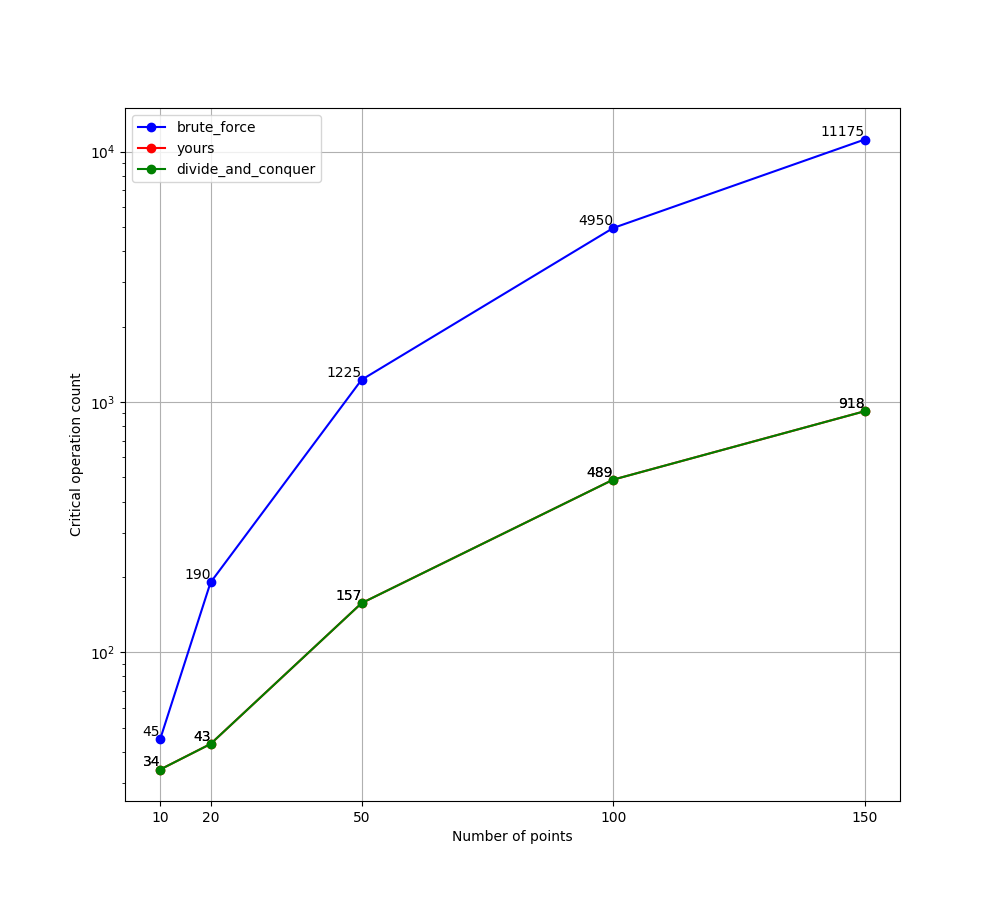

# 寻找最近点对

## 问题描述

给定一组二维平面上的点, 找出其中距离最近的一对点, 输出这个最短距离.

其中「距离」定义为[欧几里得距离](https://en.wikipedia.org/wiki/Euclidean_distance).

## 输入

有若干行内容, 第一行为一个整数, 表示点的个数 $n$.
接下来有 $n$ 行, 其中每一行为由一个空格隔开的两个整数, 分别代表一个点的 $x$ 轴和 $y$ 轴坐标. 例如:

```text
5
-34 -16
46 77
100 -37
-99 -84
-49 22
```

注: 输入保证 $n \ge 2$ 成立.

## 输出

一个浮点数, 表示所有点对之间的最小距离. 例如:

```text
40.85339643163099
```

注: 任何与正确答案误差小于等于 $10^{-9}$ 的输出都是可以接受的.

## 使用方法

- 编写代码

  你可以将你的实现写在 `closest_pairs.py` 的 `closest_pairs` 函数中, 但请保持函数签名不变.
  该函数默认使用分治算法.


- 获取输入

  运行 `generator.py` 以获得随机输入. 首先执行如下命令查看帮助信息:

  ```sh
  python3 ./generator.py -h
  ```

  例如运行
  ```sh
  python3 ./generator.py -n 10 -x -1000 -X 1000 -y -1000 -Y 1000 2
  ```
  你将会得到 2 组随机测试用例, 每组测试用例由 10 个点组成, 其中横纵坐标的取值均在 $[-1000, 1000]$ 之间.


- 测试脚本

  在 Makefile 中定义了四个目标:

    - ``make run``

      输入一个测试用例, 将输出执行的结果.
    - ``make test``

      输入一个测试用例, 将使用对拍程序判断是否输出了正确的结果.
    - ``make test_no_input``

      使用对拍程序测试实现. 可修改 Makefile 中的 `NUM` 变量以指定测试用例的数量.
    - ``make random_test``

      使用对拍程序测试实现, 并输出相关的时间信息. 可修改 Makefile 中的 `NUM` 变量以指定测试用例的数量.

- 关键操作次数对比

  运行如下命令查看不同算法的关键操作次数的对比:
  ```sh
  python3 ./metric.py
  ```
  该程序将给出在不同规模的输入数据下, 暴力算法、分治算法和你的算法的关键次数的折线图.
  例如下图所示, 对比了 $n$ 为 5, 10, 20, 50, 100, 150 时暴力算法和分治算法各自的关键操作次数:

  

  可以发现, 对于输入规模为 $n$ 的暴力算法, 关键操作次数总为 $(n-1+1)*(n-1)/2$; 值得注意的是, 对于分治算法, 由于随机性的引入, 图中曲线难以复现.
  